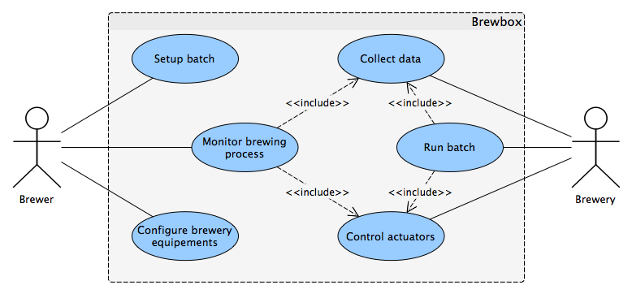

########################
Requirements
########################

BrewBox aims at helping home brewers in monitoring and controling a micro-brewery. `Functional requirements`_ section describes features needed by the system to achieve this goal. `Non-functional requirements`_ describes requirements the system must meet in order to operate in home environment by hobbyist.

Functional requirements
=======================

.. Functional requirements describes what the system is supposed to *do*.

The diagram below shows the use-cases covered by BrewBox in the home brewing process. Next sections details each uses-case scenarios and requirements.

Collect data sensors
--------------------

Control actuators
-----------------

Monitor brewing process
-----------------------

Run batch
---------

Setup brewing batch
-------------------

Configure interface with sensors/actuators
------------------------------------------

Non-functional requirements
===========================

.. Non-functional requirements describes what the system is supposed to *be*.
